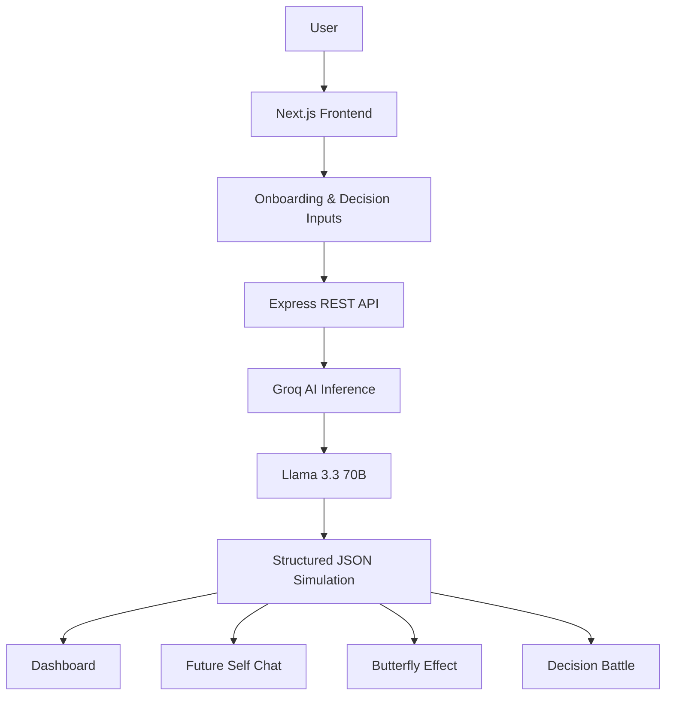
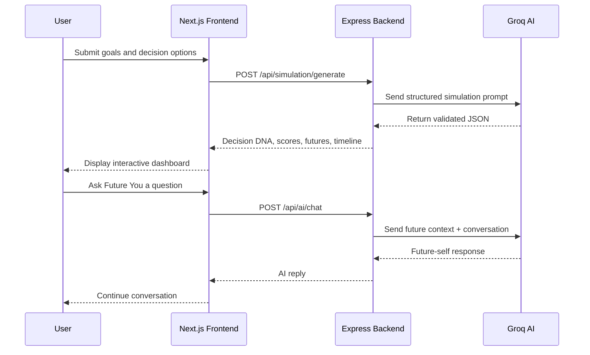
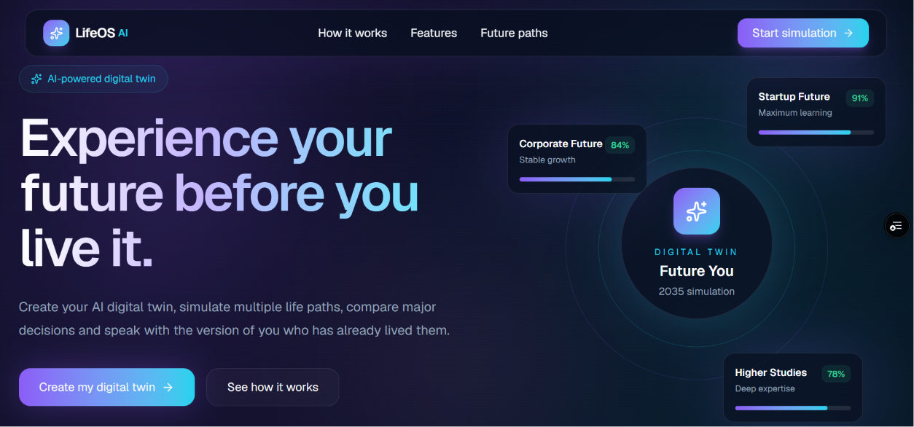
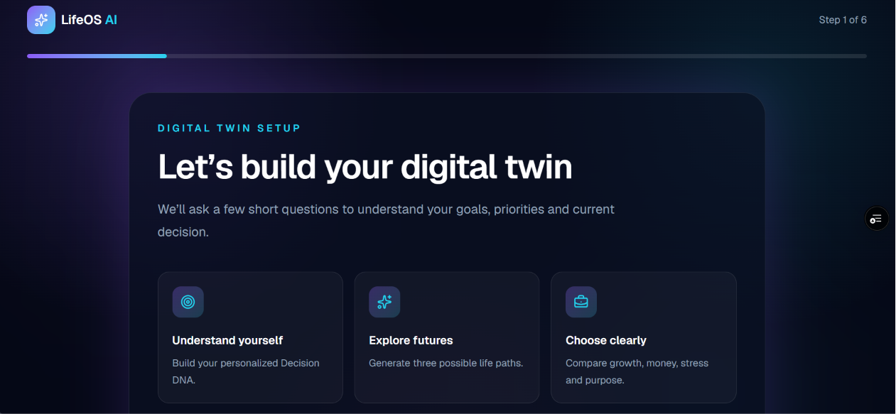
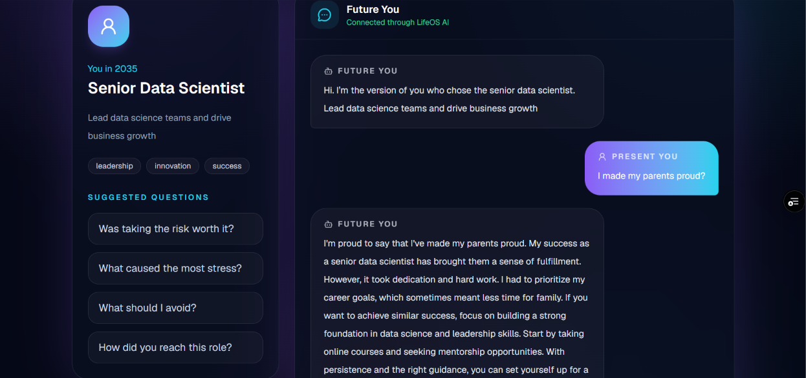
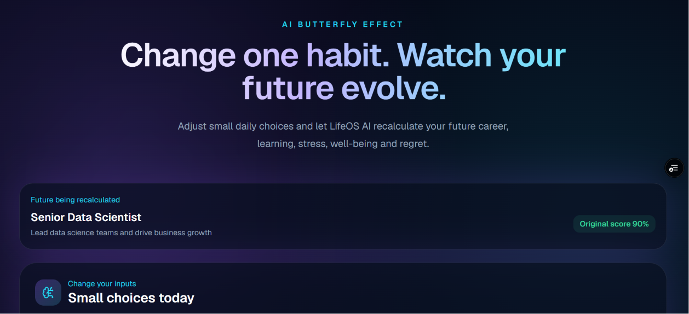
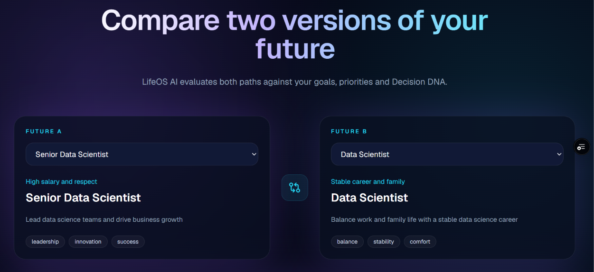

<div align="center">

# 🌌 LifeOS AI

### Experience your future before you live it.

<p>
  <a href="https://life-os-mu-puce.vercel.app">
    
  </a>
  <a href="https://github.com/Roshni2330/LifeOS">
    
  </a>
  <a href="https://lifeos-backend-ten.vercel.app/api/health">
    
  </a>
</p>

<p>
  
  
  
  
  
  
</p>

**LifeOS AI is an AI-powered decision simulation platform that creates personalized future paths, compares major life choices, visualizes the long-term impact of habits, and lets users talk to a simulated future version of themselves.**

[Live Demo](https://life-os-mu-puce.vercel.app) •
[Backend Health](https://lifeos-backend-ten.vercel.app/api/health) •
[GitHub Repository](https://github.com/Roshni2330/LifeOS)

</div>

---

## 🚀 The Idea

People make important decisions every day:

- Should I accept a stable job or prepare for a high-growth role?
- Should I choose higher studies or start earning immediately?
- Should I prioritize money, learning, balance, or long-term growth?
- How will small daily habits affect my career five years from now?

Most decision-support tools give generic advice.

**LifeOS goes one step further.**

It creates an AI-powered digital twin, generates multiple possible futures, calculates personalized life scores, explains trade-offs, and allows the user to have a conversation with their future self.

> **LifeOS does not predict one guaranteed future. It helps users explore multiple possible futures before making a decision.**

---

## ✨ Core Experience

```text
User completes onboarding
        ↓
LifeOS builds Decision DNA
        ↓
AI generates three future paths
        ↓
Dashboard displays scores and milestones
        ↓
User explores a selected future
        ↓
User talks to Future You
        ↓
Butterfly Effect recalculates outcomes
        ↓
Decision Battle compares futures
```

---

## 🧠 Key Features

### 1. Personalized Decision DNA

LifeOS builds a decision profile from the user's goals and priorities.

It analyses:

- Risk tolerance
- Learning drive
- Financial priority
- Work-life priority
- Career ambition
- Long-term goals

The result becomes the foundation for every future simulation.

### 2. AI-Generated Future Paths

LifeOS generates three distinct scenarios:

- **High-Growth Future**
- **Stable Career Future**
- **Higher Studies Future**

Each path contains:

- Title and description
- Personalized compatibility score
- Key advantages
- Major trade-offs
- Career direction
- Five-step future timeline

### 3. Life Score Dashboard

The dashboard converts the AI simulation into clear visual indicators:

- Career growth
- Financial stability
- Learning potential
- Well-being
- Stress
- Recommendation confidence

### 4. Talk to Future You

Users can enter any generated future and start a real-time AI conversation with the version of themselves who lived that path.

Example questions:

- What should I start doing today?
- What was the hardest part of this path?
- What do you regret?
- Was taking the risk worth it?
- Did this decision make you happy?
- How did you reach this role?

The response remains grounded in the selected future, user profile, previous conversation, and trade-offs of that path.

### 5. Butterfly Effect Simulator

Users can adjust:

- Focused study hours
- Exercise frequency
- Projects completed
- Networking effort

LifeOS recalculates career, finance, learning, health, stress, and regret risk, then explains why those habits may improve or weaken the selected future.

### 6. AI Decision Battle

Users can compare any two generated futures across career, finance, learning, well-being, relationships, stress, and regret.

LifeOS provides:

- Recommended future
- Recommendation confidence
- Category-level winners
- AI explanation
- Important trade-off

---

## 🏗️ System Architecture



---

## 🔄 AI Workflow



---

## 🛠️ Technology Stack

### Frontend

| Technology | Purpose |
|---|---|
| Next.js | Application framework and routing |
| React | Interactive user interface |
| TypeScript | Type-safe frontend development |
| Tailwind CSS | Responsive styling |
| Lucide React | Icons |
| Local Storage | Session-level simulation persistence |

### Backend

| Technology | Purpose |
|---|---|
| Node.js | Server runtime |
| Express.js | REST API |
| CORS | Frontend-backend communication |
| dotenv | Environment configuration |
| Groq SDK | AI inference integration |

### AI

| Technology | Purpose |
|---|---|
| Groq API | Fast AI inference |
| Llama 3.3 70B Versatile | Future simulation and conversation |
| JSON Mode | Reliable structured output |
| Prompt Engineering | Personalized simulation logic |

### Deployment

| Service | Usage |
|---|---|
| Vercel | Frontend deployment |
| Vercel | Express backend deployment |
| GitHub | Source control and collaboration |

---

## 🔌 API Endpoints

### Health Check

```http
GET /api/health
```

### Generate Future Simulation

```http
POST /api/simulation/generate
```

### Talk to Future You

```http
POST /api/ai/chat
```

### Recalculate Butterfly Effect

```http
POST /api/butterfly/recalculate
```

### Compare Futures

```http
POST /api/compare
```

---

## 📁 Project Structure

```text
LifeOS/
│
├── frontend/
│   ├── app/
│   │   ├── onboarding/
│   │   ├── simulation/
│   │   ├── dashboard/
│   │   ├── future/
│   │   │   └── [id]/
│   │   │       └── chat/
│   │   ├── butterfly/
│   │   └── compare/
│   ├── public/
│   ├── package.json
│   └── .env.local
│
├── backend/
│   ├── src/
│   │   ├── controllers/
│   │   │   ├── simulationController.js
│   │   │   ├── butterflyController.js
│   │   │   └── compareController.js
│   │   ├── routes/
│   │   │   ├── aiRoutes.js
│   │   │   ├── simulationRoutes.js
│   │   │   ├── butterflyRoutes.js
│   │   │   └── compareRoutes.js
│   │   ├── services/
│   │   │   └── groqService.js
│   │   └── server.js
│   ├── package.json
│   └── .env
│
├── vercel.json
├── .gitignore
└── README.md
```

---

## ⚙️ Local Installation

### 1. Clone the repository

```bash
git clone https://github.com/Roshni2330/LifeOS.git
cd LifeOS
```

### 2. Configure the backend

```bash
cd backend
npm install
```

Create `backend/.env`:

```env
PORT=5000
FRONTEND_URL=http://localhost:3000
GROQ_API_KEY=your_groq_api_key
```

Start the backend:

```bash
npm run dev
```

### 3. Configure the frontend

Open another terminal:

```bash
cd frontend
npm install
```

Create `frontend/.env.local`:

```env
NEXT_PUBLIC_API_URL=http://localhost:5000
```

Start the frontend:

```bash
npm run dev
```

Open:

```text
http://localhost:3000
```

---

## 🌍 Live Deployment

### Frontend

```text
https://life-os-mu-puce.vercel.app
```

### Backend

```text
https://lifeos-backend-ten.vercel.app
```

### Backend Health Check

```text
https://lifeos-backend-ten.vercel.app/api/health
```

---

## 🎬 Recommended Demo Flow

1. Open the LifeOS landing page.
2. Explain the problem in one sentence.
3. Complete onboarding with a real decision.
4. Generate the three AI future paths.
5. Show Decision DNA and Life Scores.
6. Open the recommended future.
7. Ask Future You a meaningful question.
8. Change habits in the Butterfly Effect simulator.
9. Compare two futures in Decision Battle.
10. End with the value proposition.

Suggested closing line:

> **LifeOS turns AI from a tool that answers questions into a system that helps people experience the consequences of their decisions.**

---

## 📸 Screenshots

Add screenshots inside:

```text
frontend/public/screenshots/
```

Recommended files:

```text
landing.png
onboarding.png
dashboard.png
future-chat.png
butterfly.png
compare.png
```

### Landing Page

<p align="center">
  
</p>

### AI Simulation Dashboard

<p align="center">
  
</p>

### Talk to Future You

<p align="center">
  
</p>

### Butterfly Effect Simulator

<p align="center">
  
</p>

### AI Decision Battle

<p align="center">
  
</p>

---

## 🎞️ Demo GIF

Create a short GIF showing:

```text
Onboarding → Simulation → Dashboard → Future Chat
```

Save it as:

```text
frontend/public/screenshots/lifeos-demo.gif
```

Then this section will display it:

<p align="center">
  
</p>

---

## 💡 Innovation

LifeOS combines multiple AI experiences into one decision-support system:

- Personalized digital twin
- Multi-future simulation
- Structured life scoring
- Future-self conversation
- Habit-based recalculation
- Comparative decision analysis

The platform does not simply produce a recommendation. It lets users explore the reasoning, consequences, and trade-offs behind different decisions.

---

## 🔒 Responsible AI

LifeOS is designed as a decision-support tool.

- It does not guarantee future outcomes.
- It does not replace financial, medical, legal, or career professionals.
- AI-generated futures are simulations based on user-provided information.
- Users remain responsible for their final decisions.

---

## 🗺️ Future Roadmap

- Voice conversations with Future You
- Persistent user accounts and cloud database
- Long-term conversation memory
- Goal and habit tracking
- Calendar integration
- Financial planning simulations
- Multi-language support
- Shareable future reports
- Downloadable PDF decision report
- Mobile application
- Team and mentor decision rooms

---

## 👩‍💻 Creator

**Roshni Kumari**  
B.Tech in Computer Science and Engineering  
Birla Institute of Technology, Mesra — Off Campus Deoghar

<p>
  <a href="https://github.com/Roshni2330">
    
  </a>
</p>

---

## ⭐ Why LifeOS?

LifeOS is not just another chatbot.

It transforms AI into an interactive decision laboratory where users can:

- Explore multiple possible futures
- Understand long-term consequences
- Compare meaningful trade-offs
- Test the impact of daily habits
- Receive advice from a simulated future self

> **The best way to prepare for the future is to explore it before choosing it.**

---

<div align="center">

### Built with curiosity, courage, and AI.

If this project helped or inspired you, consider giving the repository a ⭐.

[Try LifeOS](https://life-os-mu-puce.vercel.app) •
[View Source](https://github.com/Roshni2330/LifeOS)

</div>
